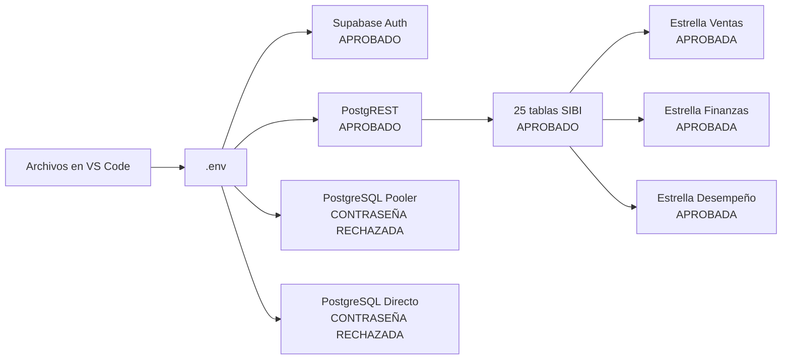

# Prueba de conexión SIBI CBN ↔ Supabase

Fecha de ejecución: 26 de julio de 2026  
Comando reproducible: `npm.cmd run supabase:verify`

## Resultado actual

| Comprobación | Resultado | Evidencia |
| --- | --- | --- |
| Supabase Auth | Aprobada | HTTP 200 |
| Supabase PostgREST | Aprobada | HTTP 200 |
| Esquema SIBI | Aprobada | 25 de 25 tablas detectadas |
| Relaciones estrella | Aprobada | 3 de 3 grupos detectados |
| PostgreSQL pooler | Pendiente | Contraseña rechazada |
| PostgreSQL directo | Pendiente | Contraseña rechazada |

Resultado global: **4/6 comprobaciones aprobadas**.

## Archivos relacionados

- `.env`: URL, publishable key y cadenas PostgreSQL.
- `lib/supabase/server.ts`: cliente Supabase del servidor.
- `app/api/auth/login/route.ts`: autenticación real cuando `DEMO_MODE=false`.
- `prisma/schema.prisma`: contrato ORM de las tablas.
- `supabase/migrations/202607260001_sibi_cbn.sql`: tablas, claves, RLS y datos maestros.
- `scripts/verify-supabase.mjs`: prueba automatizada de solo lectura.

## Limitación detectada

No se puede certificar una conexión completa mientras `DATABASE_URL` y
`DIRECT_URL` sean rechazadas. Los servicios analíticos ya consultan Prisma y
las tablas de hechos; cuando PostgreSQL no responde activan un respaldo
demostrativo claramente identificado en cada dashboard.

## Criterio de aprobación final

La integración queda aprobada cuando el comando de verificación muestre
`6/6 comprobaciones correctas` y los servicios analíticos consulten Prisma en
modo productivo.
